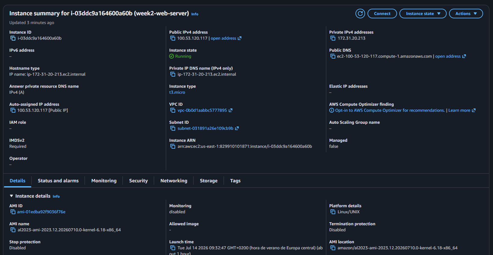
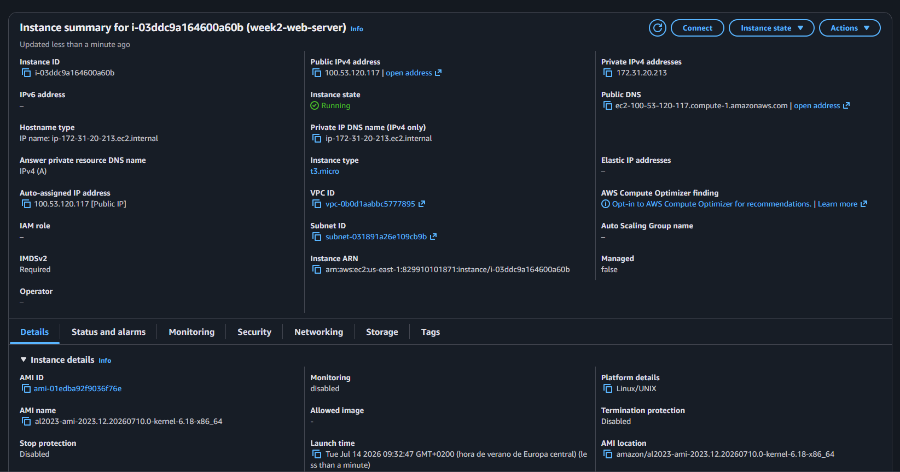
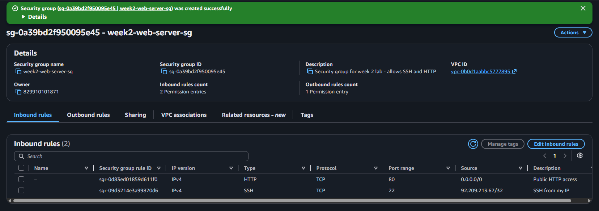
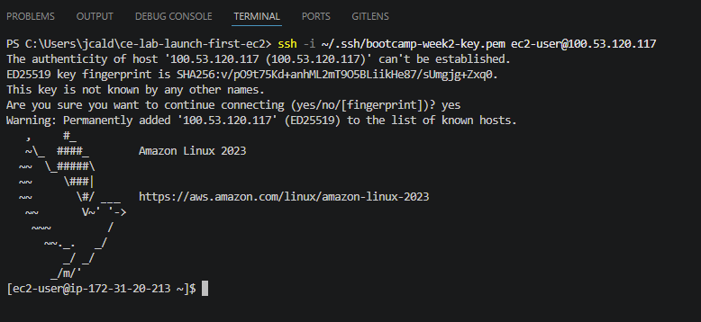
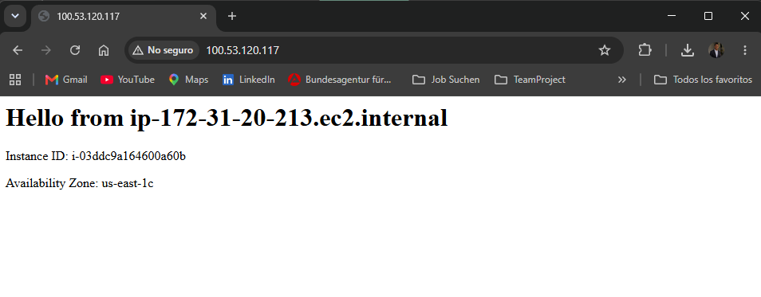
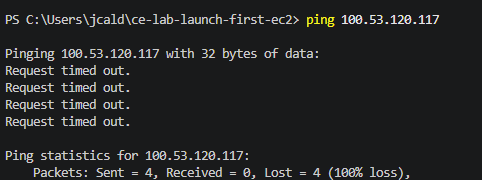
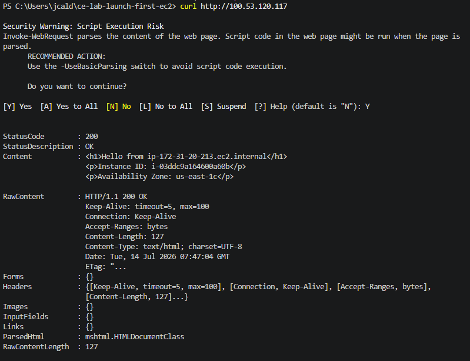
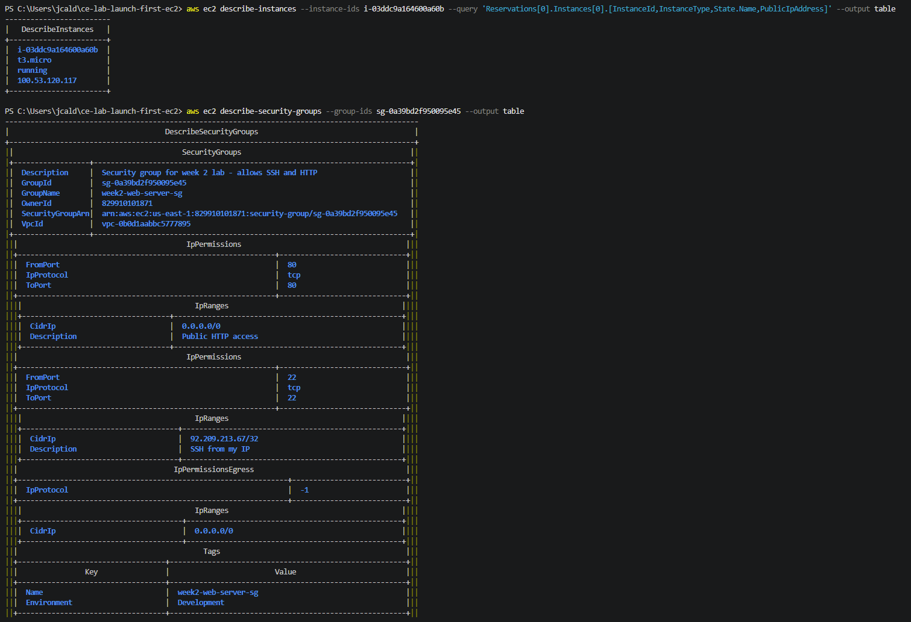

# Lab Solution - Launch first EC2

**Student Name:** Julio Cesar Aldana Almanza 
**Date:** 07/14/2026 

## Launch Instance

###Instance details

**ID:** i-03ddc9a164600a60b
**Name:** week2-web-server
**Instance Type:**  t3.micro
**Public IP Address:** 100.53.120.117

###Instance running

---

## Security group

###Security group configuration

---

## SSH Connection

###Connect via SSH

---

## Web Server

###Test the Web Server
http://100.53.120.117

---

## Security Verification

###SSH from IP
**Command:** ssh -i ~/.ssh/bootcamp-week2-key.pem ec2-user@100.53.120.117

###Ping
**Command:** ping 100.53.120.117

###HTTP
**Command:** curl http://100.53.120.117

---

## Instance Details via AWS CLI

### Get instance information
aws ec2 describe-instances --instance-ids i-03ddc9a164600a60b --query 'Reservations[0].Instances[0].[InstanceId,InstanceType,State.Name,PublicIpAddress]' --output table

### Get security group rules
aws ec2 describe-security-groups --group-ids sg-0a39bd2f950095e45 --output table

### Screenshot

